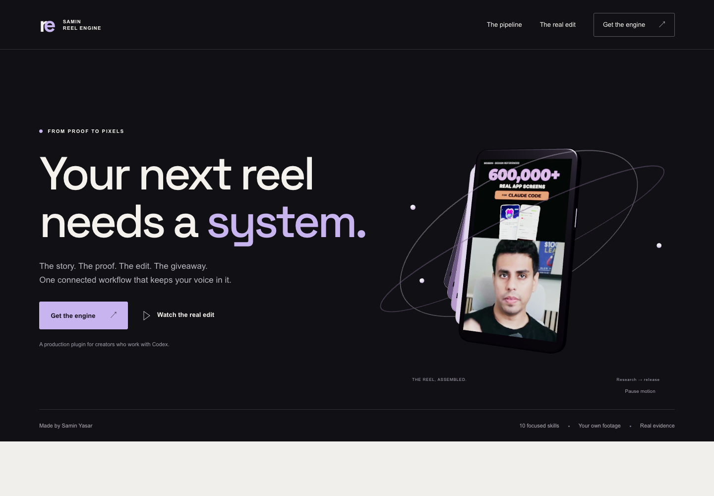

# Astra Designer

### Websites with a point of view. Built with Samin Yasar.

A portable agent skill for building and deploying distinctive websites: dimensional heroes, cinematic scroll, purposeful interactions, responsive layouts and visual checks. Bring your brand; Astra Designer handles the design-to-delivery workflow.

## Built with Astra Designer

[**Samin Reel Engine: explore the live 3D sales site →**](https://open-yoga-hpnv.here.now/)



A complete buyer journey from production friction to a real rendered reel, with an explorable pipeline, responsive 3D assembly, useful first prompts and working private email signup. [See the source, mobile examples, design decisions and deployment guide](examples/reel-engine/README.md).

## Install

```bash
git clone https://github.com/Samin12/astra-designer.git
cd astra-designer
node scripts/install.mjs
```

Installs the complete skill in your Codex skills directory. Start a fresh agent session to discover it. For a project-local or other agent installation, pass a skills directory:

```bash
node scripts/install.mjs --target .agents/skills
```

Existing installations are left untouched; choose a new target or back up/remove the old installation before reinstalling.

Claude Code can load this repository as a plugin:

```text
/plugin marketplace add Samin12/astra-designer
/plugin install astra-designer@astra-designer
```

Or point any coding agent directly at `skills/astra-designer/SKILL.md`.

## Use it

> Use $astra-designer to build and deploy a website for my brand. Use my supplied assets, add cinematic motion where it helps, and publish it with here.now.

> Use $astra-designer to build a landing page for my course. Create missing hero media with Higgsfield. Use your judgment on the design.

> Use $astra-designer to redesign this website. Keep our brand identity and make the mobile experience excellent.

## AI media

Connect your own [Higgsfield account and official CLI](https://github.com/higgsfield-ai/cli), then run `higgsfield auth login`. Astra Designer discovers live models and supports image/video generation with your references. Media generation uses your provider account and can consume credits. Supplied assets work without a generation account. No account credentials ship with this skill.

## Deployment

Static sites default to [here.now](https://here.now/docs); explicit hosting choices win. Install its official helper with `npx skills add heredotnow/skill --skill here-now -g`. The included deployment wrapper finds that helper and publishes the public directory. Anonymous hosting expires; authenticated hosting uses your account. The agent verifies the current publish result and live site.

## Included

- Complete scroll runtime with pinning, scrubbing, reveals, typography and depth.
- Design references for page structure, visual craft, asset production and accessibility.
- Working static site starter and safe installer.
- Higgsfield CLI adapter and here.now deployment adapter.
- Desktop, mobile and reduced-motion screenshot harness.

Requirements: Node 18+; full ffmpeg for media processing; Chrome/Chromium and `playwright-core` for the visual harness. No third-party creator/client branding appears in the starter or skill identity. Technical provider names remain in integration documentation; required upstream copyright notices remain in LICENSE.

MIT licensed. See [LICENSE](LICENSE).
