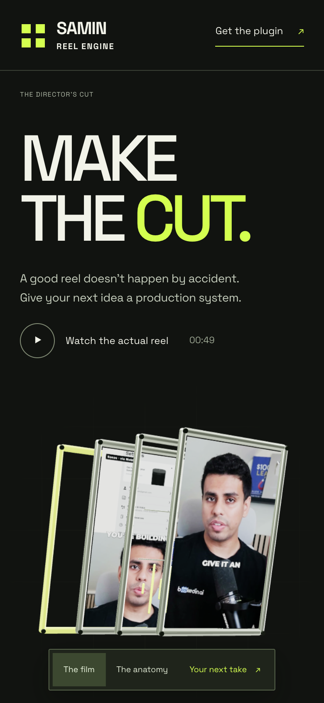

# Director's Cut

[Open the live site](https://open-yoga-hpnv.here.now/?v=3)

A new Reel Engine website made directly with the original [Scroll Craft skill](https://github.com/nateherkai/scroll-craft). Its JS/CSS engine is copied unchanged from upstream commit `0b816225945e45380397d6a0487efa3c98916858`. The bespoke Three.js scene and assembly interaction live outside the engine.


The screening-room direction combines cold chrome, acid lime, real reel footage and oversized Space Grotesk. The journey moves from the creative promise to production friction, an interactive explanation, an actual reel and a useful next step.

The signature interaction is a five-plane assembly. Scrolling pulls the source, voice, evidence, edit and review into one frame. The Direction slider gives the visitor manual control; Return to the journey reconnects it to scrolling. This is a visual explanation, not a representation of a live editor.

## Phone and motion preferences



[Phone scroll contact sheet](screenshots/mobile-scroll.png) · [Reduced-motion contact sheet](screenshots/reduced-motion.png)

Phone composition is authored separately. Reduced motion removes the pinned journey and presents a complete static assembly. The no-JavaScript version preserves the reading order and plugin/setup links. Signup requires JavaScript.

## Source and reproduction

- `site/`: the only directory deployed.
- `src/scene.js`: source for the real WebGL chrome frame.
- `site/app.js`: Scroll Craft mount, assembly controller, video dialog and signup.
- `BRIEF.md`: creative decisions, feeling curve, device score and fingerprint comparison.

Install `three`, `esbuild`, and `playwright-core` in a development workspace, then bundle with:

```sh
npx esbuild src/scene.js --bundle --minify --format=esm --outfile=site/scene.js
```

Serve `site/` over HTTP. Run the upstream Scroll Craft `shoot.mjs` against the served page for desktop, phone and reduced motion.

## Verification

Desktop and emulated 390px phone: no horizontal overflow or page errors. The original Scroll Craft harness found no dead scroll and verified that the five-second scrub advances. Inspected the rendered contact sheets. Tested manual assembly, keyboard End, return to scroll, video dialog, Escape/pause, signup success and reduced-motion/no-JavaScript content. Physical iOS hardware has not been tested.

The visual review corrected initially occluded chrome layers and excessive mobile assembly width. Final perceived sequence: curiosity, recognition, agency, proof, momentum, matching the authored curve. The assembly receives the longest span (3.2 viewports). Whole desktop page: approximately 8.1 viewports.

## Leads and publishing

The deployment updates the existing authenticated here.now site and preserves its lead collection. The form inserts email, explicit consent and source into owner-readable Site Data. There is no outbound email service or active checkout. See the [lead export guide](../reel-engine/README.md) and [privacy page](site/privacy.html).

Third-party names visible inside the real showcase are source material within the reel, not website branding. Media attribution and required engine/font/library licenses are retained in the public package.
