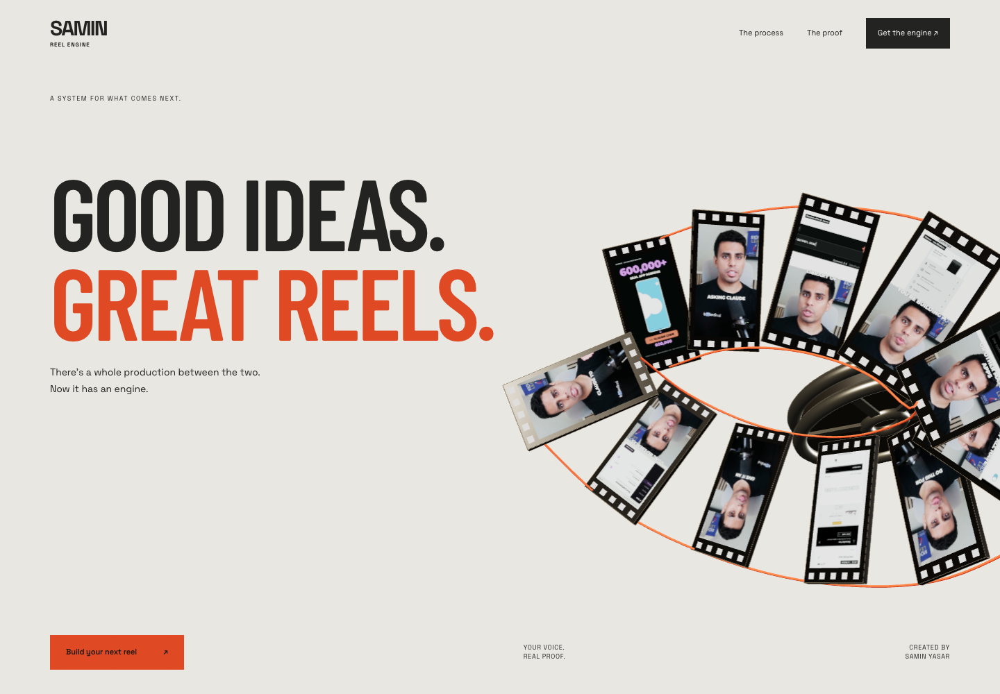
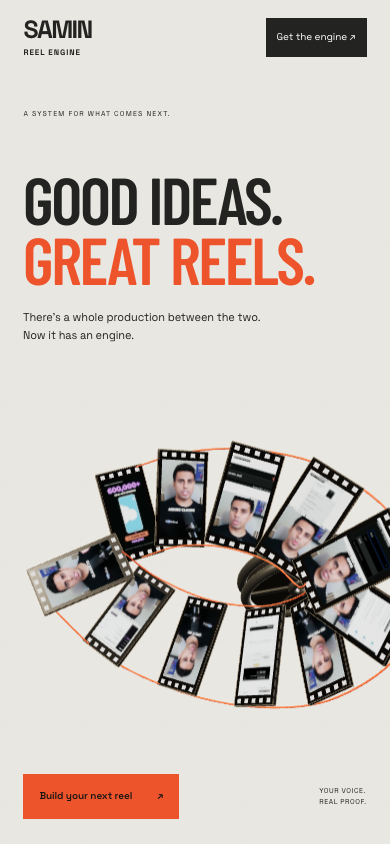

# Proof to Pixels: Reel Engine, rebuilt

[Open the live experience](https://open-yoga-hpnv.here.now/?v=2)

This version uses Astra Designer's actual engine. A 3D photographic filmstrip reads the opening act's `--sc-p`, shifting from a loose coil to an ordered sequence. The engine drives the pinned copy, horizontal process rail, scrubbed real reel opening and flow entries.

The page moves from the production problem to a connected process, real output and signup. Condensed editorial typography, warm paper, dark ink and vermilion are the campaign direction. No fake testimonials, performance promises or simulated software interface.

## Source and operation

- `site/`: complete public artifact, including fonts, runtime, real video and the private-write signup manifest.
- `src/scene.js`: original Three.js scene. Run `npm ci && npm run build` here to rebuild it.
- `BRIEF.md`: buyer journey, scene states and scope.

Serve locally: `node ../../skills/astra-designer/scripts/serve.mjs --root site --port 4520`.

Deploy an authorized update: `node ../../skills/astra-designer/scripts/deploy.mjs site --slug open-yoga-hpnv`.

The live site keeps the original owner-only email collection. No new email marketing service or payment processor is configured. Lead management and private export remain described in [the operations guide](../reel-engine/README.md#email-signup-is-live).

## Checked

Desktop and mobile compositions; real engine progress; video scrub advances; playback modal and Escape/pause; signup states; reduced-motion reading layout; no-JavaScript fallback; and horizontal overflow. The scroll harness checks the engine directly, with no standalone override. Physical-device testing and payment processing are not claimed.

