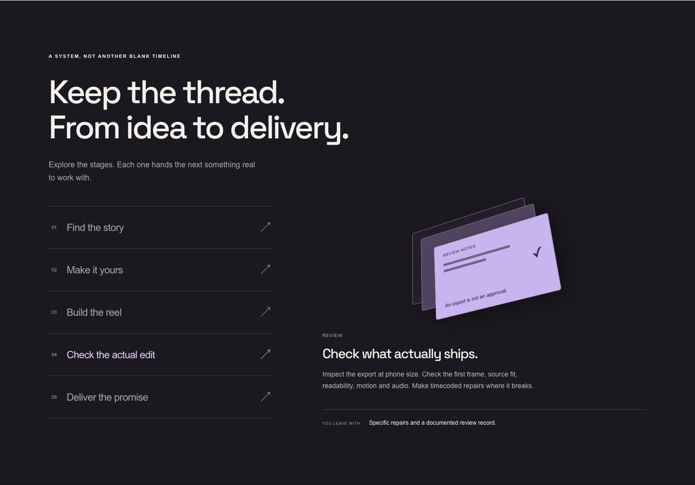
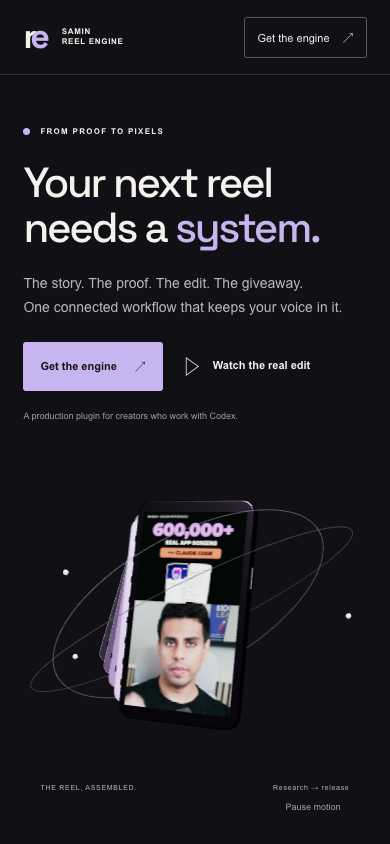

# Reel Engine: a complete Astra Designer example

[Open the live 3D website](https://open-yoga-hpnv.here.now/)


A real sales site for [Samin Reel Engine](https://github.com/Samin12/samin-reel-engine-plugin), built with Astra Designer. It uses a local Three.js WebGL scene, an actual rendered reel and a working private email-signup backend. No AI-generated marketing proof or invented customer metrics.

## The buyer journey

| Visitor question | Site answer |
|---|---|
| Why do I need this? | Name the friction between research, script, footage, proof and giveaway. |
| How does it work? | Explore five stages covering the ten focused skills. Each selection shows its real output. |
| Can it make something good? | Play the actual published showcase, with its original production context and credits. |
| Where would I start? | Choose idea, footage or rough cut and copy a useful first prompt. |
| What do I need? | Honest setup, account, license and publishing boundaries. |
| What should I do next? | Open the plugin/setup guide or opt into product updates. |

The 3D assembly is a visual metaphor for bringing the pieces together. It is not a simulated software UI. Phone poster and video are actual product examples. The website serves a 720p compressed copy of the source 1080p export.





## Run and rebuild

The checked-in `site/` folder is deployable as-is. To change the 3D scene:

```bash
cd examples/reel-engine
npm ci
npm run build
node ../../skills/astra-designer/scripts/serve.mjs --root site --port 4518
```

Edit `site/index.html`, `site/style.css` and `site/app.js` for page content and interactions. Edit `src/scene.js` for Three.js. `site/config.js` contains the optional hosted-checkout configuration. Libraries and fonts are served locally with their licenses.

## Email signup is live

The manifest in `site/.herenow/data.json` creates the leads collection. Visitors can insert; only the owner can read, update or delete. Email consent is explicit. A honeypot and provider rate limit reduce casual spam. The browser reports success only after a confirmed stored record. A failed request retains the idempotency key for retry.

Manage signups in the here.now dashboard: open this Site, then Manage → Database → leads. Or export privately:

```bash
node scripts/export-leads.mjs exports/leads.csv
```

The exporter reads your existing private hosting credentials. Its default export directory is ignored by Git. Never commit subscriber records. Verify consent before contacting anyone. This site captures opt-ins; it does not send emails or connect an email marketing platform.

## Payments

No payment provider, price or fulfillment terms were supplied, so checkout is intentionally inactive. Once a real hosted checkout exists, set `checkoutUrl` and `checkoutLabel` in `site/config.js` and redeploy. The link should describe the actual offer and price. Use the payment provider's checkout; never collect card details in Site Data. Hosted checkout does not itself implement gated plugin delivery or payment webhooks.

## Deploy updates

```bash
node ../../skills/astra-designer/scripts/deploy.mjs site --slug open-yoga-hpnv
```

This slug belongs to Samin's live site. Other users should omit `--slug` to create their own site. The hosting account must own the site for email storage to work. Never publish the whole example directory: `site/` is the public artifact.

## Verification

Checked desktop (1440px), phone layout (390px), reduced motion and JavaScript-disabled fallback. No horizontal overflow or browser errors in these runs. Keyboard stage navigation, workflow selection, CTA links and live video decoding were exercised. A real form submission returned 201, owner readback confirmed persistence, and public listing returned 403. The synthetic record was removed after verification. Physical-device testing, email sending and payments were not performed.

See [BRIEF.md](BRIEF.md) for the authored buyer journey and [site/credits.html](site/credits.html) for asset credits.
